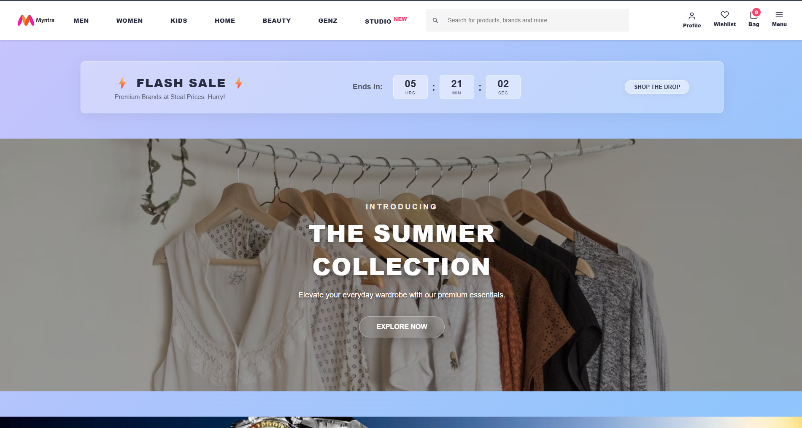
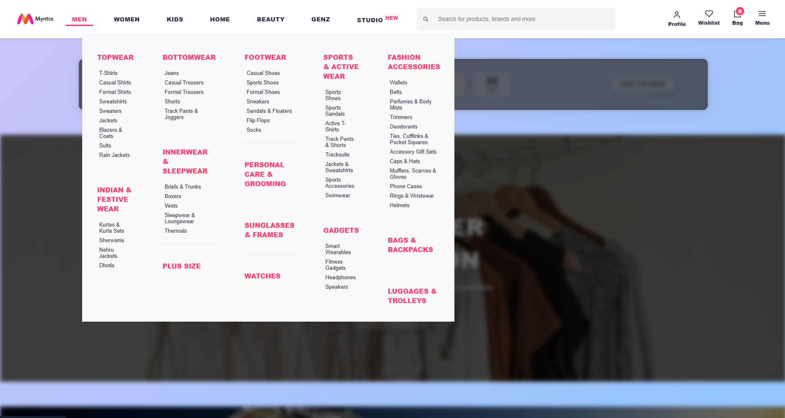
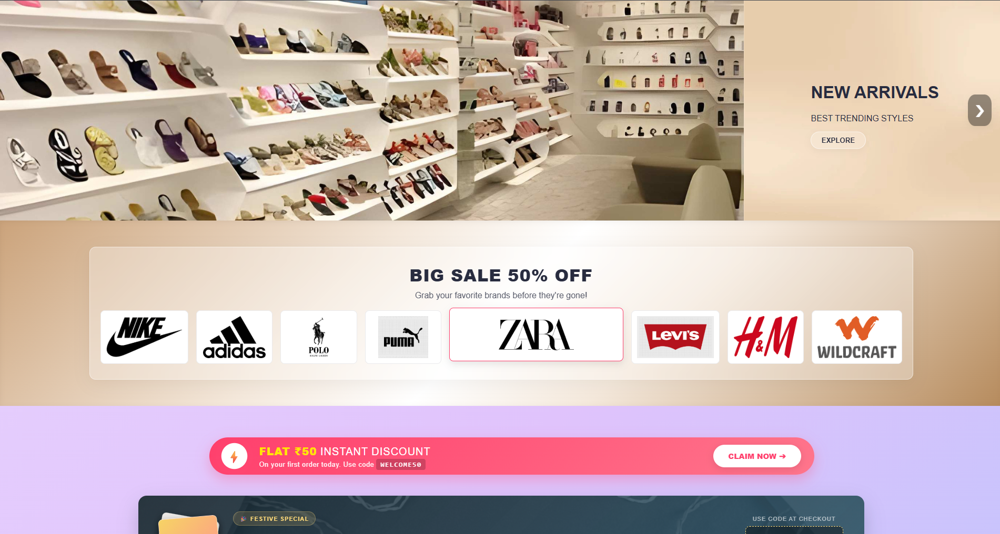
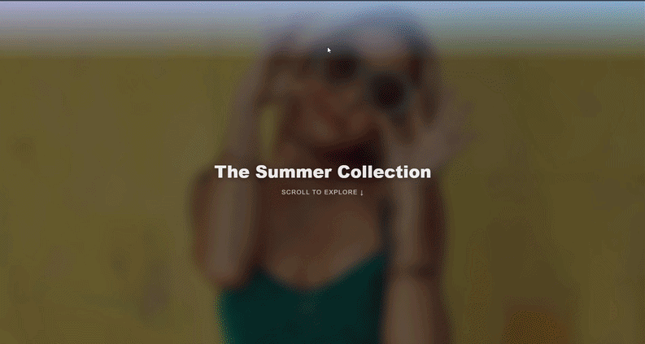

🛍️ ShopNow - Premium E-Commerce UI
A highly interactive, visually stunning e-commerce frontend inspired by top-tier fashion platforms like Myntra. Built with a focus on cutting-edge UI/UX, buttery-smooth animations, and premium glassmorphism aesthetics.

✨ Key Features
This project moves beyond standard layouts, incorporating "Awwwards-level" interactions and modern web design trends:

🎬 Cinematic Scroll Expansion: Features a scroll-driven, full-screen expansion animation (The "Atypica" section) where a focal image seamlessly scales to fill the viewport as the user scrolls, revealing a dark-mode horizontal product carousel.

🪞 Glassmorphism Aesthetics: Utilizes a global fluid pastel background with frosted-glass containers, side panels, and buttons for a highly modern, layered feel.

💳 Interactive Offer Banners: * A vibrant, pulsing "Pill" banner for welcome discounts.

A deep-navy banking banner featuring dynamic, overlapping credit cards that physically fan out when hovered.

🛒 Modern Product Cards: Clean, edge-to-edge imagery with floating badges, rating rows, and a sleek "Add to Bag" button that slides up on hover.

📱 Horizontal Snap Carousels: Premium left-to-right scrolling product rows with CSS scroll-snapping for a native-app feel.

🗂️ Advanced Mega Menu: A highly detailed, solid-background dropdown navigation system that prevents visual clutter.

🌙 Dark Mode Integration: A fully functional light/dark theme toggle that beautifully inverts the glass panels, typography, and shadows.

🛍️ Functional Cart & Wishlist: JavaScript-powered slide-out panels that dynamically track added items, calculate totals, and manage state.

📸 Sneak Peek
(I recommend taking a few screenshots or a screen recording of your cinematic scroll and pasting them here!)

🛠️ Tech Stack
Frontend: Pure HTML5, CSS3, and Vanilla JavaScript.

Styling: Custom CSS Flexbox & Grid, CSS Variables, Keyframe Animations, Backdrop-filters.

No external libraries or frameworks were used, ensuring lightning-fast load times and complete control over the DOM.

🚀 Quick Start
To view the project locally, you don't need any build tools or dependencies:

Clone the repository:

Bash
git clone https://github.com/your-username/ShopNow.git
Navigate to the project folder:

Bash
cd ShopNow
Open index1.html directly in any modern web browser. (Alternatively, use an extension like VS Code's "Live Server" for the best experience).

💡 Learnings & Architecture
Building this project involved mastering complex CSS positioning, utilizing getBoundingClientRect() in JavaScript to sync DOM elements perfectly with the user's scrollbar, and managing Z-indexes across deeply nested layout grids. The separation of global themes (Dark vs. Light mode) using root-level class toggles ensures the UI remains scalable and easy to maintain.

Designed and built by Deekshitulu
